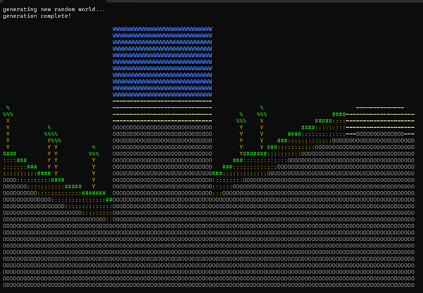

# Procedural World Generator (C++)

A high-performance, CLI-based terrain generation engine that utilizes mathematical functions and randomization algorithms to create diverse 2D environments.

## 🛠 Technical Highlights
* **Procedural Generation:** Implements `std::sin` wave functions combined with `std::mt19937` (Mersenne Twister) for deterministic yet organic-looking terrain.
* **Biome Logic:** Features a State-based biome mapper (Plains, Forest, Desert, Ocean) with unique block palettes and object generation (e.g., tree structures).
* **ANSI Color Rendering:** Utilizes escape codes for high-fidelity CLI visualization of different material types.
* **OOP Principles:** * **Encapsulation:** Core world logic is abstracted within `world` and `world_generator` classes.
    * **Data Structures:** Efficient use of 2D `std::vector` for grid management and `std::map` for biome configuration.
      
### 🖼 Preview


## 🚀 Getting Started

### Prerequisites
* A C++ compiler (GCC 7+ or Clang)
* A terminal that supports ANSI colors (standard on Linux/macOS, or Windows Terminal)

### Compilation
Use the following command to compile the source:
```bash
g++ -O3 main.cpp -o worldgen
```
